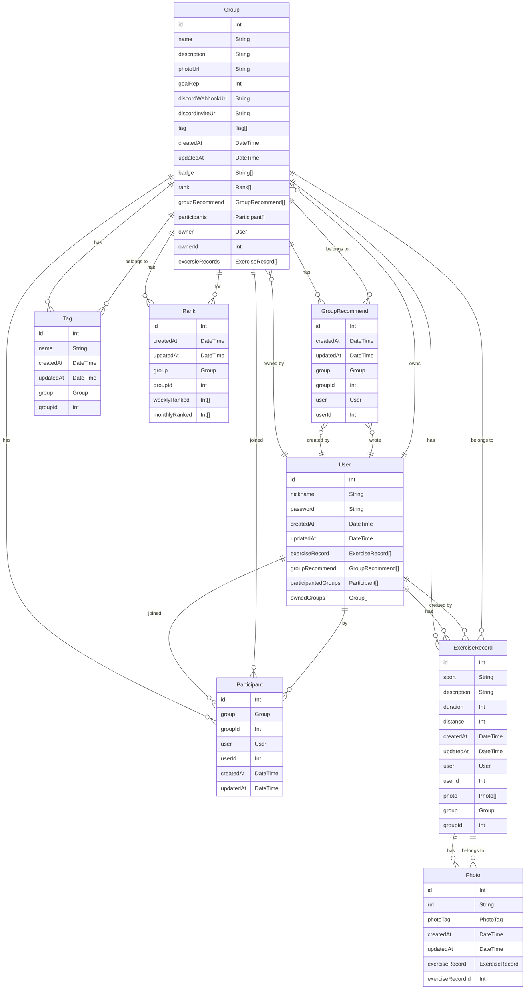

# SEVEN 2팀

## 🧑‍💻 팀원 구성
*아래 프로필 사진을 클릭하면 각 팀원의 GitHub 프로필로 이동합니다.*
<table>
  <tr>
    <td align="center">
      <a href="https://github.com/singnyeo">
        
      </a><br />
      <sub><b>강시연</b></sub>
    </td>
    <td align="center">
      <a href="https://github.com/kimsumin0605">
        
      </a><br />
      <sub><b>김수민</b></sub>
    </td>
    <td align="center">
      <a href="https://github.com/Solomon-Psk153">
        
      </a><br />
      <sub><b>박성국</b></sub>
    </td>
    <td align="center">
      <a href="https://github.com/JONGJIN-LEE1">
        
      </a><br />
      <sub><b>이종진</b></sub>
    </td>
    <td align="center">
      <a href="https://github.com/jrkgus413">
        
      </a><br />
      <sub><b>조가현</b></sub>
    </td>
    <td align="center">
      <a href="https://github.com/chya-chya">
        
      </a><br />
      <sub><b>차수연</b></sub>
    </td>
  </tr>
</table>

## 💡 프로젝트 소개
### 🏋️ SEVEN 
- **소개**: 운동 인증 커뮤니티 서비스 백엔드 시스템 구축
- **프로젝트 기간**: 2025.06.02 ~ 2025.06.20

> 매일의 운동, 혼자 하지 마세요.  
> **SEVEN**은 당신의 노력과 성장을 함께 나누는 운동 인증 커뮤니티입니다.  
> 
> 지금 이 순간의 땀이,  
> 누군가에게는 **시작의 용기**가 되고,  
> 또 다른 누군가에게는 **지속의 동기부여**가 됩니다.  
> 
> 하루하루 쌓아가는 기록이  
> 곧 당신만의 루틴이 되고,  
> 함께하는 이들의 **성장 여정**이 됩니다.  
> 
> **오늘의 운동을 인증하고,  
> 사람들과 공유하며 함께 성장하세요!** 💪🔥  
> 
> #운동인증 #함께성장 #SEVEN


## 🛠️ 기술 스택

- **Backend**: Express.js, PrismaORM
- **Database**: Prisma, PostgreSQL
- **API 문서화**: Swagger
- **공통 Tool**: Git & Github, Discord, Notion

## 🤝 [팀 협업 문서](https://www.notion.so/206fca01d5c980689666cc5d59fbef08?source=copy_link)

- **📌 Notion**으로 정리된 협업 문서입니다.  
- 팀원 역할, 일정, 커뮤니케이션 규칙 등을 확인하세요.

## ⚙️ 팀원별 구현 기능 상세
### **차수연**
### **그룹 등록**
  - 그룹명, 설명, 닉네임, 비밀번호, 사진(한 장), 태그, 목표 횟수, 디스코드 웹훅 URL, 디스코드 서버 초대 URL 입력 등록
<table style="width:100%; table-layout: fixed;">
  <tr>
    <td align="center" style="width:33%;">
      <br/>
      <b>POST 그룹 생성</b>
    </td>
    <td align="center" style="width:33%;">
      <br/>
      <b>POST 그룹 생성 결과</b>
    </td>
    <td align="center" style="width:33%;">
      <br/>
      <b>FRONT 그룹 생성</b>
    </td>
  </tr>
</table>

### **그룹 수정**
  - 비밀번호를 입력하여 그룹 등록 시 입력했던 비밀번호와 일치할 경우 수정
<table style="width:100%; table-layout: fixed;">
  <tr>
    <td align="center" style="width:50%;">
      <br/>
      <b>Front 목표 횟수 10 → 15</b>
    </td>
    <td align="center" style="width:50%;">
      <br/>
      <b>Front 목표 횟수 10 → 15 결과</b>
    </td>
  </tr>
  <tr>
    <td align="center" style="width:50%;">
      <br/>
      <b>PATCH groupId: 6 레포츠 → 헬스마니아</b>
    </td>
    <td align="center" style="width:50%;">
      <br/>
      <b>PATCH groupId: 6 레포츠 → 헬스마니아 결과</b>
    </td>
  </tr>
</table>

### **그룹 삭제**
  - 비밀번호를 입력하여 그룹 등록 시 입력했던 비밀번호와 일치할 경우 삭제 가능
<table>
  <tr>
    <td align="center">
      <br/>
      <b>DELETE 그룹 삭제 비밀번호 입력</b>
    </td>
    <td align="center">
      <br/>
      <b>DELETE 그룹 삭제</b>
    </td>
  </tr>
</table>

### **이미지 업로드**
  - 이미지 파일을 업로드하면 URL 목록을 반환
  - 여러 파일 업로드 가능
  - 이미지 파일만 허용

<table>
  <tr>
    <td align="center">
      <br/>
      <b>이미지 등록</b>
    </td>
    <td align="center">
      <br/>
      <b>이미지 등록 결과</b>
    </td>
  </tr>
</table>

---

### 이종진
### **그룹 목록 조회**
  - 각 그룹의 그룹명, 닉네임, 사진, 태그, 목표 횟수, 추천수, 참여자수가 표시
  - 최신순, 추천순, 참여자순으로 정렬
  - 그룹명으로 검색
  - 페이지네이션
  <table>
  <tr>
    <td align="center">
      <br/>
      <b>GET 그룹 목록 조회</b>
    </td>
    <td align="center">
      <br/>
      <b>GET 그룹 목록 조회 페이지네이션</b>
    </td>
  </tr>
</table>

<table>
  <tr>
    <td align="center">
      <br/>
      <b>FRONT 그룹 목록 조회</b>
    </td>
  </tr>
</table>

### **그룹 상세 조회**
  - 그룹명, 설명, 닉네임, 사진, 태그, 목표 횟수, 참여자 수, 디스코드 서버 초대 URL을 조회
  <table>
  <tr>
    <td align="center">
      <br/>
      <b>그룹 상세 조회</b>
    </td>
  </tr>
</table>

### **그룹 추천**
  - 그룹 추천이 호출될 때마다 추천수가 1씩 증가
  <table style="width:100%; table-layout: fixed;">
  <tr>
    <td align="center" style="width:33%;">
      <br/>
      <b>FRONT 그룹 추천</b>
    </td>
    <td align="center" style="width:33%;">
      <br/>
      <b>POST 그룹 추천</b>
    </td>
    <td align="center" style="width:33%;">
      <br/>
      <b>DELETE 그룹 추천 취소</b>
    </td>
  </tr>
</table>

---

### 조가현
### **그룹 참여**
  - 닉네임과 비밀번호를 입력하여 그룹 참여
    - 그룹 내에서 중복된 닉네임 등록 불가
  - 비밀번호 인증을 통해 그룹 참여 취소가 가능
  - 참여를 취소하면 해당 닉네임이 생성한 운동 기록은 모두 삭제
<table style="width:100%; table-layout: fixed;">
  <tr>
    <td align="center" style="width:50%;">
     <br/>
      <b>POST 그룹 참여</b>
    </td>
    <td align="center" style="width:50%;">
      <br/>
      <b>GET 그룹, 그룹 참여 결과</b>
    </td>
  </tr>
  <tr>
    <td align="center" style="width:50%;">
      <br/>
      <b>FRONT 그룹 참여 취소</b>
    </td>
    <td align="center" style="width:50%;">
      <br/>
      <b>DELETE 그룹 참여 취소</b>
    </td>
  </tr>
</table>

### **그룹 배지**
  - 그룹이 일정 조건을 달성하면 자동으로 배지 획득
    - 참여자 10명 이상
    - 운동 기록 100개 이상
    - 추천수 100 이상

---

### 박성국
- **기록 등록**
  - 닉네임, 운동 종류(달리기, 자전거, 수영), 설명, 시간, 거리, 사진(여러장 가능), 비밀번호 입력하여 운동 기록 등록
  - 타이머를 통해 측정된 실제 운동한 만큼의 시간만 입력 가능
  - 닉네임, 비밀번호를 확인하여 그룹에 등록된 유저일 때만 기록 등록
  - 새로운 운동 기록이 등록 되었을 때 그룹에 등록된 디스코드 웹 서버 알림 전송
<table>
  <tr>
    <td align="center">
      <br/>
      <b>FRONT 기록 등록</b>
    </td>
    <td align="center">
      <br/>
      <b>FRONT 디스코트 웹 서버 알림</b>
    </td>
  </tr>
</table>


- **태그 목록 조회**
  - 등록된 태그 목록 조회
  - 태그 이름으로 검색 가능
  - 생성일 기준 정렬
  - 페이지네이션
- **태그 상세 조회**
  - 태그 이름, 생성일, 수정일 조회
  <table>
  <tr>
    <td align="center">
      <br/>
      <b>그룹 태그 조회</b>
      <td align="center">
      <br/>
      <b>그룹 태그 상세 조회</b>
    </td>
  </tr>
</table>

    
---

### 김수민
**기록 목록 조회**

- 그룹 내에 등록된 모든 유저의 운동 기록 조회 가능
- 닉네임, 운동 종류, 시간, 거리, 사진 표시
- 최신순, 운동시간순 정렬
- 닉네임 검색
- 페이지네이션
<table>
  <tr>
    <td align="center">
      <br/>
      <b>FRONT 기록 목록 조회</b>
    </td>
    <td align="center">
      <br/>
      <b>FRONT 기록 목록 조회 페이지네이션</b>
    </td>
  </tr>
</table>

<table>
  <tr>
    <td align="center">
      <br/>
      <b>GET 기록 목록 조회</b>
    </td>
  </tr>
</table>

---

### 강시연
**기록 상세 조회**
- 운동 종류, 설명, 사진(여러장), 시간, 거리, 닉네임 조회

<table>
  <tr>
    <td align="center">
      <br/>
      <b>GET 기록 목록 상세 조회</b>
    </td>
  </tr>
</table>

**기록 랭킹 조회**
- 운동 기록 많은 순으로 주간, 월간 랭킹 조회
- 닉네임, 기록 횟수, 누적 시간 조회
- 페이지네이션

<table>
  <tr>
    <td align="center">
      <br/>
      <b>GET 기록 랭킹 조회</b>
    </td>
    <td align="center">
      <br/>
      <b>GET 기록 랭킹 조회 페이지네이션</b>
    </td>
  </tr>
</table>

<table>
  <tr>
    <td align="center">
      <br/>
      <b>FRONT 기록 랭크 조회</b>
    </td>
  </tr>
</table>

### 공통 요구 사항

- **객체 지향 프로그래밍 적용**
  - Router 코드와 Request Handler 함수에 해당하는 코드 분리
  - Request Handler에 해당하는 코드들을 모아서, Controller라는 클래스 구현
  - Controller 클래스의 함수를 Router 등록
- **일관된 에러처리 구현**
  - Express.js의 Global Error Handler 구현
  - 개별 Request Handler에서 에러가 발생하는 경우, Global Error Handler에서 처리하도록 구현
- **ORM에서 select 고급 활용**
  - 그룹 목록 조회에서 참여자의 수를 리스폰스로 전달하는 경우처럼 연결된 모델의 개수가 필요한 경우, 하나의 `findMany()` 메서드 안에서 처리할 수 있도록 구현

## 🧩 ERD


## 📂 백엔드 파일 구조
```
backend
 ┣ controllers
 ┃ ┣ group-controller.js
 ┃ ┣ group-participant-controller.js
 ┃ ┣ records-controller.js 
 ┃ ┗ records-view-controller.ts
 ┣ middleware
 ┃ ┣ error-handler.js
 ┃ ┗ validation-check.js
 ┣ prisma
 ┃ ┣ schema.prisma
 ┃ ┗ seed.js
 ┣ routes
 ┃ ┣ groups.js
 ┃ ┗ records.js
 ┣ swagger
 ┃ ┣ openapi.yaml
 ┃ ┗ swagger.js 
 ┣ utils
 ┃ ┣ const.js
 ┃ ┣ db.js
 ┃ ┗ error.js
 ┣ .env
 ┣ .gitignore
 ┣ app.js
 ┣ package-lock.json
 ┗ package.json
 
README.md
```

## 구현 홈페이지
[프론트엔드 서버 배포 주소](https://nb02-seven-team2-mobq.onrender.com/)
/
[백엔드 서버 배포 주소](https://three-sprint-mission-4goe.onrender.com/)

